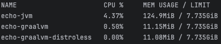

# Echo GraalVM

A simple Telegram bot that echoes messages back to the user.
The objective is to experiment with GraalVM while generating native-images from a Clojure application.

**Echoes only text messages**

## Usage

Local deploy - `linux/amd64`

1. Clone the repository
2. Rename the file `resources/config.edn.example` to `resources/config.edn`.
3. Fill the `resources/config.edn` file with your Telegram bot token.
4. Run the docker container: `docker compose up -d`

## Experiment Results

A simple Clojure application (a Telegram echo bot) deployed to a Docker container consuming less than 10 MiB of RAM.

`docker stats` output:

## License

Copyright © 2025 Bruno do Nascimento Maciel

This program and the accompanying materials are made available under the
terms of the Eclipse Public License 2.0 which is available at
http://www.eclipse.org/legal/epl-2.0.

This Source Code may also be made available under the following Secondary
Licenses when the conditions for such availability set forth in the Eclipse
Public License, v. 2.0 are satisfied: GNU General Public License as published by
the Free Software Foundation, either version 2 of the License, or (at your
option) any later version, with the GNU Classpath Exception which is available
at https://www.gnu.org/software/classpath/license.html.
